# Design proposals — task #14's three residual items

**2026-08-06. For the owner to pick from. Nothing here has shipped, and the branch this is on
(`design/14-proposals`) is a camera rig, not an implementation.**

Every screenshot below came out of the real app on the real seed, iPhone 16 Plus
(`24D1629F…`, 430 pt), light and dark run separately with `xcrun simctl ui … appearance`.
Every contrast ratio was computed, not eyeballed — method and calibration at the bottom.

| Item | Recommendation | One new value? |
|---|---|---|
| **1a · 17's dark amber (E85)** | **17b** — one dark amber for *boundaries*, marks unchanged | one: `#A2670D` |
| **1b · 16's dark readout (E85)** | **no change** — looked at, it holds | none |
| **2 · the share link (E60)** | **10a + unclamp the line limit** | none |
| **3 · the vacant-site tile (E119/E122)** | **12a** — the dashed well at tile size | none |

Three things I found on the way that are **not** mine to close — a light-mode AA failure, a dark
tile that E122 only half-fixed, and the short-slug question. They are at the end.

---

## Item 1a · Screen 17's amber after dark (E85)

**The question, as E85 states it:** "The terminal row is `border.amberMid` on `surface.card` with
`signal.amber` text, and in dark all three of those collapse toward the single `#D99A4E` the
palette gives dark amber. The card, its word and its tile glyph are then the same hue at three
different weights."

It is worse than three. Screen 17 draws **four distinct ambers in light** and **one** in dark:

| Role | Light | Dark today |
|---|---|---|
| header pill border | `#EBD3A8` | `#D99A4E` |
| C24 card border | `#B8803A` (R1 darkened this deliberately) | `#D99A4E` |
| `retry` state word | `#B4711F` (`accentAmber`) | `#D99A4E` |
| reason line, tile glyph, pill text | `#8A5A17` | `#D99A4E` |

The render is the argument. In dark the terminal card's border is the **loudest** thing on the
screen — louder than any word on it — where in light it is quieter than the text it surrounds.

| light, as it ships | dark, as it ships |
|---|---|
| 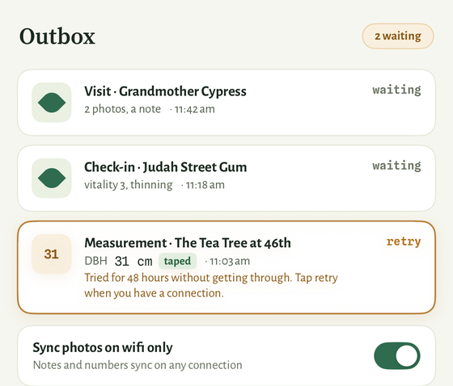 | 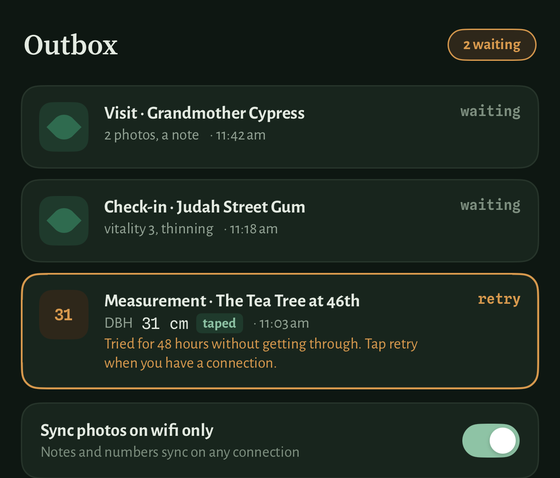 |

### Recommended — 17b · one new dark amber, for boundaries only

`amberAttentionCardBorder` and `amberPillBorder` take **`#A2670D`** after dark. Every amber
*mark* — the `retry` word, the reason line, the tile glyph, the pill text — stays at `#D99A4E`,
exactly where E8's derivation put it.


**Where `#A2670D` comes from.** A lightness-only move in OKLCh from `dark.accent.amber`
`#D99A4E`, which is R1's method and the E120/E122 precedent, run downward instead of up:

```
#D99A4E  L 0.7328  C 0.1193  H 69.11°   ← the one amber the dark palette has
#A2670D  L 0.5648  C 0.1189  H 69.35°   ← ΔL −0.168, ΔC −0.0004, ΔH +0.24°
```

Chroma and hue are held to within 0.0004 and a quarter of a degree, so it is the same amber at a
lower value — no hue enters the palette, which is the discipline R7 and E8 both keep.

**Why that lightness.** It puts the dark border at **3.39:1** on `surface.card` — the *same* ratio
R1 chose for the light border, so the boundary reads at one strength in both appearances. It clears
WCAG 1.4.11's 3.0 floor, which binds here because R1 established that C24's border is the only
thing distinguishing this card (`surface.card` on `surface.screen` is 1.09:1).

| Pair | Light | Dark today | Dark, 17b |
|---|---|---|---|
| card border on the card | 3.39 | 6.57 | **3.39** |
| card border on the page behind it | 3.12 | 7.55 | **3.90** |
| pill border on the pill fill | 1.28 | 6.11 | **3.15** |
| `retry` word on the card | 3.95 | 6.57 | 6.57 *(unchanged)* |
| reason line / tile glyph | 5.91 / 5.18 | 6.57 / 6.11 | 6.57 / 6.11 *(unchanged)* |

Two rungs where dark had one; boundary below mark, as light has it.

### Alternate — 17a · three rungs, adding a control rung

The `retry` word also moves, to **`#C18436`** (L 0.6611, C 0.1190, H 69.43° — the same
lightness-only line), landing at **5.01:1** on the card. Three rungs, mirroring light's ordering
exactly: boundary 3.39 < control 5.01 < mark 6.57.

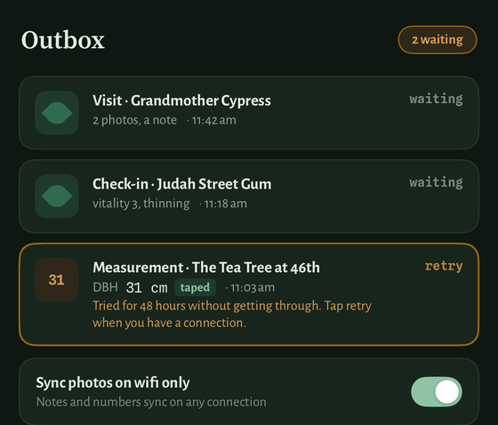

**The cost, and it is why this is the alternate.** The state word is `accentAmber` — Signal Amber,
a *brand hue* with a reserved meaning ("this tree needs something", §1.1) that also draws the map
pin. Moving its dark value takes the amber map pin from **7.08:1 to 5.40:1** on the dark map paper.
Still well over the 3.0 floor `ContrastTests` pins, but it is a brand hue changing on a screen
nobody asked about. Avoiding that means splitting the state word onto its own token — a second new
value, for a rung the render shows is subtle.

### Alternate — do nothing, and pin the collapse

Defensible: every dark amber pair already clears AA comfortably (6.11–7.55), so the collapse costs
no accessibility, only hierarchy. R9 declined a *light* amber collapse and E122 recorded that "no
entry in ERRATA records anyone missing the distinction" in dark. If the loud border reads as fine
to you, the right outcome is to say so in ERRATA and stop re-opening it.

---

## Item 1b · Screen 16's 56 pt readout after dark (E85)

**The question:** "A 56 pt mono number in `text.ink` over `surface.screen` is the largest single
piece of type in the app, and the dark pair (`#E4EBE2` on `#0E1712`) has not been looked at at
that size."

**Looked at. Recommendation: leave it.**

| light | dark, as it ships | 16a `#DBE1D9` | 16b `#AEBBAB` |
|---|---|---|---|
| 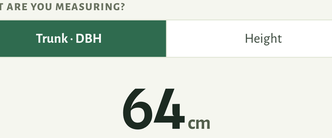 |  | 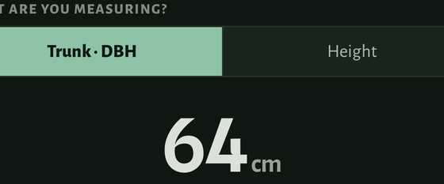 | 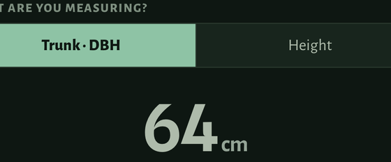 |

**The receipt.** Dark reads at **15.03:1**, light at **13.77:1** — a 9% difference, and dark is the
stronger one, which is the halation worry stated as a number. Two things close it:

- **16a**, a lightness-only dim to light parity (`#DBE1D9`, 13.73:1), is **ΔE 0.029 in OKLab** from
  the shipped value. That is above E8's 0.02 "stop minting, the designer already wrote this color"
  threshold and far below its 0.05 rejection tolerance — in the render the two are hard to tell
  apart, which the screenshots above show. It buys a new token for a move nobody can see.
- **16b**, dropping to the documented `text.body` dark rung `#AEBBAB` (9.13:1), is visibly wrong:
  the readout becomes **quieter than the keypad digits below it**, which are drawn in the same
  `text.ink` and do not move. The subject of the screen must not be the dimmest thing on it.

And the structural cost either way: `text.ink` is a **transcribed** D2 value, so changing it for one
call site means either overruling the designer app-wide or minting a screen-16-only ink token.
For 0.029 in OKLab, neither is worth it.

If you want it a hair calmer anyway, 16a is the one — and it should be `overruled`, not `derived`.

---

## Item 2 · The share-link block on screen 10 (E60)

**The question:** E60 recorded that the mock's four-hex slug cannot name one of 195,309 trees, so
the card renders the tree's own UUID — and "36 characters of mono 10.5 do not fit the drawn card
beside a 72 pt thumbnail. It wraps rather than truncating."

**What the rig found, and it changes the shape of the answer:** the string is `cypress.app/sf/tree/`
plus a 36-character UUID — **56 characters**. The card's *full inner width* holds about 48 at the
drawn size. **No two-row arrangement makes it one line.** Widening the row is not the fix; giving
two lines a place to live is.

**And at accessibility sizes it does not wrap at all — it truncates to nothing.** `lineLimit(2)` in
a column that narrow yields `cypress.app/sf/tree/0…`: the reader gets **none** of the identifier.
That is precisely the outcome E60 says is worse than two lines, happening today.

### Recommended — 10a, plus unclamping the line limit at accessibility sizes

Row 1 is the thumb beside name + location + strip, exactly as drawn. Row 2 is the link, at the
card's full inner width, below both.

| shipped | 10a |
|---|---|
| 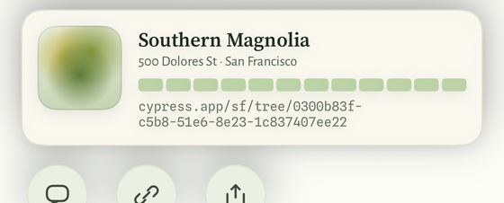 | 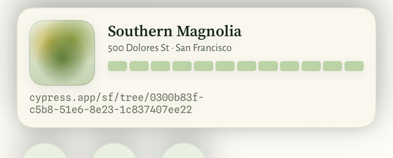 |

Still two lines at the drawn size — but they start at the card's left edge, run its full width, and
read as one address block rather than as overflow squeezed beside a picture. No new token, no new
spacing: `ShareMetrics.urlTop` (6) is the gap, `ShareMetrics.cardPadding` (14) the inset.

At AX5 the difference is not cosmetic:

| shipped, AX5 | 10a, AX5 | 10a + unclamped, AX5 |
|---|---|---|
| 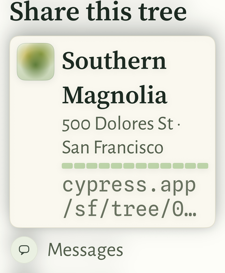 | 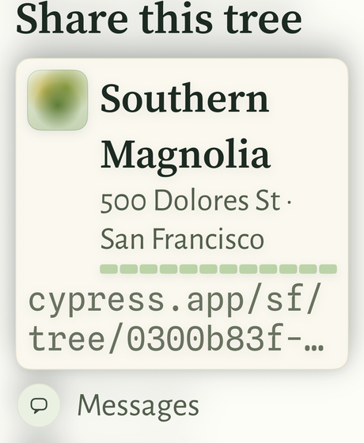 | 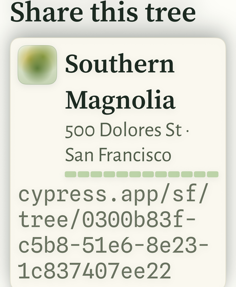 |

`cypress.app/sf/tree/0…` → `cypress.app/sf/tree/0300b83f-…` → the whole link, over four lines,
no ellipsis. The third is 10a with `lineLimit` released above the accessibility threshold. It is the
only arrangement in which somebody at AX5 can read or type this link at all — which is the reason
E60 gives for refusing to truncate it in the first place.

### Alternate — 10b · the link row indented to the text column

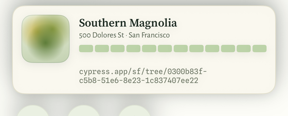

Keeps the card's existing left rhythm (everything but the thumb starts at one x). It wraps at the
same character as shipped and leaves the thumb's 72 pt of gutter unused, so it buys the visual
tidiness without the width.

### Alternate — 10c · the strip goes wide too

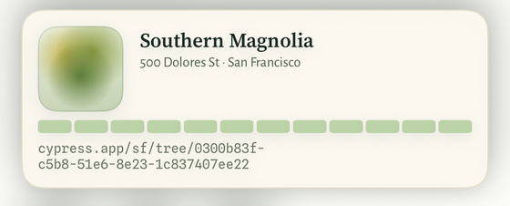

Row 1 is thumb + name + location; row 2 is the strip at full width, then the link. The 12 cells
read better wide and the text column stops carrying three different kinds of thing. It costs
vertical space and leaves a gap beside the bottom of the thumb.

---

## Item 3 · The vacant-site tile (E119, E122)

**What is actually still open.** E122 closed the *contrast* half — base and highlight were swapped
so the tile stopped reading as an almost-blank square. It did not touch the *treatment*: the tile is
still a 34 pt rounded square with a radial-gradient blob at 45%/42%, which is the **same drawing**
as the five living-tree tiles beside it, differing only in color. ROADMAP §1's decision on vacant
sites is "a distinct planting-site state, **not a variant of the tree profile**", and R7/E119/E123
gave the family a drawn vocabulary everywhere else — the map pin, the empty photo well, the site
screen, `LocationPrompt`. The almanac tile is the one member still wearing the tree's clothes.

### Recommended — 12a · the empty well, at tile size

`surfaceEmptyThumb` under a dashed `borderDashedStrong` edge — the exact treatment 14's empty photo
well, the site screen and `LocationPrompt` already draw, shrunk to 34 pt. **No new token, no new
hue**, and off the map the dashed stroke is what this family already speaks. (E119 chose a *solid*
ring for the map pin because on the map dashes mean the community layer, DECISIONS §3.16. There is
no community layer on screen 12.)

| light: shipped / 12a / 12b |
|---|
| 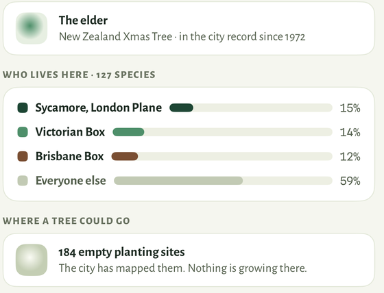 |
| 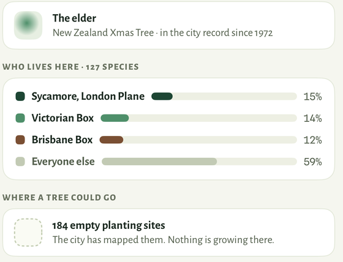 |
|  |

Next to "The elder" one row up, 12a is unmistakably a different *kind* of thing rather than a faded
tree. Shipped is a sibling of it.

### Alternate — 12b · the map pin's hollow ring

A ring in `borderDashedStrong` on the same pale ground, so the almanac row and the map pin are
literally the same mark. Cross-surface consistency is the whole argument. Against it: at 34 pt a
ring can read as a bullet or a status dot, where a dashed frame can only read as an empty place.

### On contrast, so it is not asked

No C10 tile clears 3:1 against its card and none is meant to — `elder`'s base is 1.18:1, the vacant
mark 1.64:1, the same house-style band as `border.cool` at 1.15:1 that `ContrastTests.knownFailures`
already records. This item is a treatment question, not an accessibility one.

---

## Three things I could not close

**1 · An unpinned AA failure in *light*, found while measuring 17.** The `retry` / `stopped` state
word is `accentAmber` `#B4711F` at 11 pt mono **bold** on `surface.card`: **3.95:1**, against a 4.5
floor (11 pt bold is not WCAG "large text"). It is on `surface.screen` at 3.63. `ContrastTests` pins
`accentAmber` only as a *map pin* against map paper at a 3.0 floor, so nothing in the suite is
watching this pair. The cheapest honest closure is a call-site change, not a token one: draw the
state word in `amberChipSelectedText` (`#8A5A17`, **5.91:1**), which is what the reason line
directly beneath it already uses. Do **not** retint Signal Amber — it is a brand hue and it draws
the map pin. Worth an ERRATA entry either way.

**2 · E122's vacant tile is still nearly invisible in dark.** The swap measured 1.05 → 1.64:1 on the
card in light. In dark `borderDashedStrong` `#364133` on `surface.card` `#18251D` is **1.48:1**, and
the render shows what that means:

| dark: shipped / 12a / 12b |
|---|
| 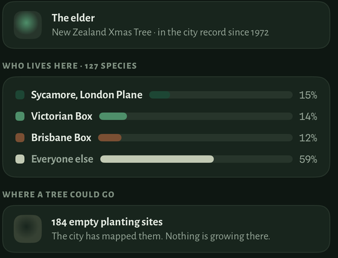 |
|  |
| 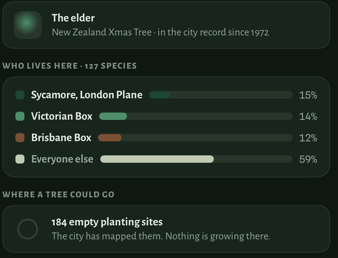 |

Both proposed treatments read in dark; the shipped gradient does not. That is an argument for 12a
independent of the treatment argument, and it is also a finding about E122 worth recording.

**3 · The short public slug is still the owner's call.** E60 already named it: "A short public slug
(a base32 of the id, say) would restore the single line and is a design decision, not an
implementation one." It is the only thing that makes the link one line at any type size, and it
changes the app's **public identifier** — DECISIONS §2.5 commits to "stable citable tree UUIDs".
That is above a design agent's authority and I have not proposed a form for it.

---

## Method, and how the instrument was calibrated

Contrast is WCAG 2.1 relative luminance, implemented to match `ContrastTests.swift`'s own
`luminance()`. OKLab/OKLCh is Ottosson's transform. **Before any number below was believed, the
script was run against fifteen pairs whose answers this repo already pins** — `retinted`,
`knownFailures` and the two rungs R1 did not move. All fifteen reproduced within 0.005 (tolerance
0.05): C10 light 3.06/3.056, C10 dark 3.05/3.055, C23 series 1 dark 3.05/3.050, `text.faint` on the
screen 4.62/4.624, `text.ink` on a card dark 13.08/13.079, C24 on the page dark 7.55/7.550, the 311
border 1.82/1.819, and so on. The OKLCh half was calibrated the same way: E120's `#A8B29C → #7F8974`
reproduces as chroma held to 0.0002 and hue to 1.0°, and `ΔE(#D9A05B, #D99A4E)` comes out 0.0163
against E8's stated 0.016.

**The renders were calibrated too**, because a screenshot of the wrong thing looks exactly like a
screenshot of the right thing, and the first run produced three of them:

- The first light run's AX5 shots used the wrong content-size-category string and were not at AX5 at
  all — caught because the AX5 file was byte-identical in size to the default one.
- The first dark run photographed **an empty outbox**: this device's queue holds nothing, so all
  three screen-17 variants were the same picture of "Nothing is waiting to send." The rig now draws
  SCREENS.md 17's own state from the fixture the previews use.
- The same run photographed **an empty readout**: screen 16 draws the dimmed `text.faint`
  placeholder until a digit is entered, so the 56 pt `text.ink` number this item is about was not on
  screen. The rig now types `64` on the keypad.
- Light and dark were confirmed by sampling the page pixel: `(245,246,239)` = `#F5F6EF`
  `surface.screen` light, `(14,23,18)` = `#0E1712` dark.

The rig itself is `Cypress/App/DesignProposalVariant.swift`,
`CypressUITests/DesignProposalShots.swift` and five call-site patches. It is throwaway. When a
proposal is picked it is implemented in the token layer — with its registry row, its gallery entry
and its `ContrastTests` pin — and every one of those files is deleted.
